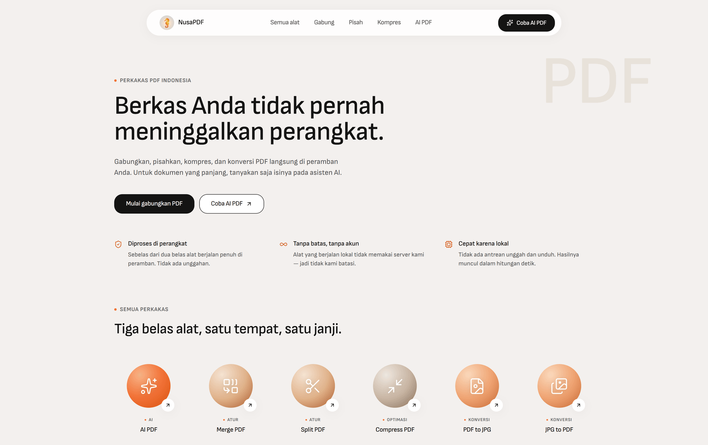

<div align="center">

# NusaPDF

**Perkakas PDF yang memproses berkas di peramban Anda — bukan di server kami.**

[**Coba langsung → nusapdf.vercel.app**](https://nusapdf.vercel.app)

[](./LICENSE)
[](https://nextjs.org)
[](https://vercel.com)

</div>

<!-- Tangkapan layar beranda. Ganti berkasnya kapan saja tanpa mengubah baris ini:
      -->

---

Gabungkan, pisahkan, kompres, dan konversi PDF — termasuk ke dan dari Word, PowerPoint, serta Excel — **tanpa berkas Anda pernah meninggalkan perangkat**. Untuk dokumen panjang, tanyakan saja isinya pada asisten AI.

**11 dari 12 alat berjalan sepenuhnya di peramban.** Hanya AI PDF yang mengunggah, dan itu dinyatakan terang-terangan sebelum berkas dikirim.

Klaimnya bisa Anda uji sendiri: buka **DevTools → Network**, lalu jalankan Merge atau Compress. Tidak ada satu pun permintaan yang membawa isi berkas.

| | |
|---|---|
| **Atur** | Merge · Split · Compress |
| **Konversi** | PDF ↔ JPG · PDF ↔ Word · PDF ↔ PowerPoint · PDF ↔ Excel |
| **AI** | Chat dengan PDF, dengan sitasi per halaman yang bisa diklik |

Dibangun mengikuti [PRD-NusaPDF.md](./PRD-NusaPDF.md) — termasuk keputusan arsitektur beserta harganya, bukan hanya hasil akhirnya.

---

## Menjalankan

```bash
npm install
npm run dev          # http://localhost:3000
```

Kesebelas alat client-side berfungsi penuh **tanpa konfigurasi apa pun**. Hanya AI PDF yang memerlukan kredensial:

```bash
cp .env.example .env.local   # lalu isi nilainya
```

Tanpa `.env.local`, aplikasi tetap berjalan dan AI PDF menampilkan pemberitahuan "belum diaktifkan" — bukan error.

| Perintah | Fungsi |
|---|---|
| `npm run dev` | Server pengembangan (Turbopack) |
| `npm run build` | Build produksi + typecheck |
| `npm run typecheck` | Typecheck saja |
| `npm run verify` | Jalankan seluruh pemeriksaan di bawah |
| `npm run verify:pdf` | Uji mesin PDF terhadap fixture buatan |
| `npm run verify:ai` | Uji ekstraksi teks, pemotongan, dan failover kunci Gemini |
| `npm run verify:office` | Uji baca/tulis .xlsx & .pptx dan mesin tata letak PDF |

---

## Arsitektur

Pemrosesan bersifat **hybrid**, dan pembagiannya adalah keputusan produk, bukan sekadar teknis:

| Alat | Tempat | Konsekuensi |
|---|---|---|
| Merge, Split, Compress, PDF↔JPG | **Peramban** | Berkas tidak pernah menyentuh jaringan. Tanpa batas kuota, karena tidak memakai server kami. |
| PDF↔Word, PDF↔PowerPoint, PDF↔Excel | **Peramban** | Sama — lihat batas fidelitasnya di bawah. |
| AI PDF | **Server** | Perlu unggah. Dinyatakan eksplisit ke pengguna sebelum berkas dikirim; dihapus otomatis ≤24 jam. |

11 dari 12 alat berjalan penuh di peramban.

### Mesin PDF

- **`lib/pdf/worker.ts`** — operasi pdf-lib (merge, split, compress, images→PDF) di dalam Web Worker via Comlink. Ini yang akan membekukan UI bila dijalankan di main thread.
- **`lib/pdf/render.ts`** — pdf.js untuk render thumbnail, viewer, dan PDF→gambar. pdf.js sudah memindahkan *parsing* ke worker-nya sendiri; rasterisasi dijalankan satu halaman sekaligus dengan `await` di antaranya agar event loop tetap responsif.
- pdf.js diimpor **dinamis** — ia menyentuh `DOMMatrix` saat evaluasi modul, yang akan menggagalkan prerender Next.

**Kompresi** mendekode ulang gambar JPEG tertanam pada resolusi & kualitas lebih rendah, lalu menulisnya kembali ke struktur PDF yang sama. Halaman **tidak** diraster, sehingga teks tetap dapat diseleksi dan dicari — konsekuensinya dokumen yang isinya hampir seluruhnya teks hanya menyusut sedikit, dan UI menyatakan itu apa adanya.

### Konversi Office

Berjalan di peramban, bukan server. Ini keputusan yang punya harga, dan harganya **fidelitas isi, bukan fidelitas tata letak**: teks, daftar, dan tabel berpindah; jenis huruf, posisi gambar, header/footer, dan penomoran halaman asli tidak direkonstruksi. Alternatifnya — LibreOffice dalam kontainer atau API konversi berbayar — memberi kemiripan piksel tetapi membatalkan janji utama produk dan menuntut infrastruktur yang belum ada. Setiap alat konversi menyatakan batas itu di panelnya sebelum tombol ditekan (PRD risiko R1).

Satu pengecualian: **PDF → PowerPoint** merender tiap halaman sebagai gambar slide, jadi tampilannya justru terjaga sempurna — dengan konsekuensi teksnya tidak bisa diedit.

Pustaka: `mammoth` (baca .docx), `docx` (tulis .docx), `pptxgenjs` (tulis .pptx). Pembaca `.xlsx` dan `.pptx` ditulis sendiri di `lib/office/` di atas `fflate` — build npm SheetJS membawa advisory prototype-pollution **tanpa perbaikan**, dan itu tidak bisa diterima ketika input-nya berkas yang diseret pengguna. Seluruh pustaka berat diimpor dinamis agar hanya terunduh saat alatnya dibuka.

`lib/office/pdf-writer.ts` adalah mesin tata letak kecil di atas pdf-lib: pdf-lib menggambar teks pada koordinat dan tidak mengenal alur, pembungkusan, atau paginasi. Font standar PDF ber-encoding WinAnsi dan pdf-lib **melempar galat** pada karakter di luarnya — karena itu ada `sanitise()`, supaya satu tanda kutip miring tidak menggagalkan seluruh konversi.

Format lama `.doc`, `.ppt`, `.xls` sengaja ditolak: keduanya wadah biner OLE, bukan arsip XML, jadi pembaca di sini memang tidak bisa membukanya.

### AI PDF — RAG

Alurnya: teks diekstrak per halaman di server (pdf.js *legacy build*, satu-satunya yang jalan di Node) → dipotong ~1.200 karakter dengan tumpang tindih 200, **tanpa pernah melintasi batas halaman** → di-embed dengan `gemini-embedding-001` pada 768 dimensi → disimpan di pgvector → saat bertanya, pertanyaan di-embed lalu 10 potongan teratas diambil dan diberikan ke model.

Batas halaman dijaga utuh karena itulah yang membuat sitasi `[hal. N]` akurat: potongan yang membentang di halaman 6 dan 7 hanya bisa diatribusikan ke salah satunya. Nomor halaman menjadi fakta tercatat, bukan ingatan model — dan halaman yang boleh disitasi dibatasi hanya pada yang benar-benar dilihat model, sehingga sitasi tidak bisa mengarah ke halaman keliru.

Sitasi memakai penanda inline `[hal. N]`, bukan structured output — JSON tidak dapat di-stream sebagai prosa yang enak dibaca, sedangkan penanda inline mengalir alami lalu diubah menjadi chip yang dapat diklik saat render.

Embedding memakai *task type* asimetris (`RETRIEVAL_DOCUMENT` untuk potongan, `RETRIEVAL_QUERY` untuk pertanyaan) dan dinormalisasi ulang setelah dipangkas ke 768 dimensi — tanpa itu, norm-nya melenceng dan merusak jarak kosinus.

### Kolam kunci Gemini

Hingga empat kunci (`GEMINI_API_KEY`, `GEMINI_API_KEY_2..4`) membentuk kolam failover di `lib/ai/key-pool.ts`. Ketika satu kunci mencapai batas per-menit atau per-hari, kunci itu diberi masa tenang (90 detik untuk rate limit, 3 jam bila pesannya menandakan batas harian) dan permintaan berpindah ke kunci berikutnya. Titik awal berputar antar permintaan agar beban tersebar.

Yang penting: **hanya galat kuota** yang memicu failover. Permintaan yang salah bentuk diteruskan apa adanya — kalau tidak, satu kesalahan klien akan menghanguskan keempat kunci sekaligus. Perilaku ini diuji di `npm run verify:ai`.

Status kolam bersifat per-instance dan disimpan di memori; pada platform serverless tiap instance belajar sendiri kunci mana yang habis. Biayanya satu permintaan sia-sia per instance per kunci — jauh lebih murah daripada membaca penyimpanan bersama pada setiap panggilan.

### Variabel di Vercel

Enam variabel harus diisi di dashboard Vercel sebelum deploy pertama. Nilainya tidak pernah ikut ter-commit — yang ada di repo hanya `.env.example`.

| Variabel | Sensitive | Catatan |
|---|---|---|
| `NEXT_PUBLIC_SUPABASE_URL` | tidak perlu | Disisipkan ke bundle peramban saat build |
| `NEXT_PUBLIC_SUPABASE_ANON_KEY` | tidak perlu | Sama — yang menjaga data adalah RLS, bukan kerahasiaan kunci ini |
| `SUPABASE_SERVICE_ROLE_KEY` | **ya** | Melewati seluruh RLS |
| `GEMINI_API_KEY` | **ya** | Minimal satu; `_2`–`_4` opsional untuk failover |
| `GEMINI_MODEL_FAST` | tidak perlu | Opsional; kosong = `gemini-3.7-flash` |
| `CRON_SECRET` | **ya** | Tanpa ini `/api/cron/purge` menonaktifkan diri dan retensi tidak ditegakkan |

Variabel `NEXT_PUBLIC_*` dibaca **saat build**, bukan saat runtime — menambahkannya ke deployment yang sudah jadi tidak berpengaruh sampai ada build ulang.

### Deployment

`vercel.json` mengunci dua hal:

- **`regions: ["sin1"]`** — fungsi berjalan di Singapura, sekitar 5–15 ms dari Supabase. Region default Vercel ada di Amerika, dan setiap panggilan database akan menyeberangi Pasifik (~200–250 ms). Route ingest melakukan belasan round trip plus mengunduh berkas hingga 50 MB dari storage, jadi region yang salah langsung memakan anggaran 60 detik.
- **Cron `/api/cron/purge`** pukul 02:00 WIB (`0 19 * * *`, jadwal cron Vercel memakai UTC) — menghapus dokumen AI PDF yang lewat masa simpan.

Endpoint purge dilindungi `CRON_SECRET`; tanpa nilai itu ia menonaktifkan diri (503) alih-alih terbuka, karena endpoint hapus-massal tanpa autentikasi adalah masalah yang jauh lebih besar daripada cron yang tidak jalan.

> **Catatan retensi:** paket Hobby membatasi cron **sekali sehari**, sehingga jarak terburuk antara kedaluwarsa dan penghapusan bisa mencapai ~48 jam. Bila Anda ingin klaim "24 jam" berlaku ketat, sapuan perlu dijalankan setiap jam — lewat paket Pro, atau `pg_cron` + `pg_net` di Supabase yang memanggil endpoint yang sama.

### Auth

Supabase `signInAnonymously()` memberi setiap pengunjung `auth.uid()` sungguhan sejak kunjungan pertama. Akibatnya seluruh kebijakan RLS cukup berupa pemeriksaan kepemilikan sederhana — tidak ada jalur "tamu" terpisah — dan `linkIdentity()` mempertahankan uid yang sama sehingga riwayat percakapan ikut terbawa saat pengguna mendaftar.

Kuota ditegakkan **sepenuhnya di server** (`lib/ai/quota.ts`); meteran di UI hanya menampilkannya. Kuota dicadangkan sebelum panggilan Gemini dan dikembalikan bila gagal, sehingga error tidak pernah memotong jatah pengguna.

---

## Struktur

```
app/
  (tools)/            11 alat client-side
  ai-pdf/             ruang kerja AI
  api/                route handler (dokumen, percakapan SSE, kuota)
  privasi/ bantuan/ faq/ tentang/ + 4 halaman legal
components/
  shell/ home/ tools/ ai/ content/ ui/
lib/
  pdf/                worker + render + ekstraksi teks berposisi
  office/             ooxml, xlsx, pptx, pdf-writer, convert
  ai/                 gemini, embed, retrieve, kuota, key-pool
  supabase/           client, server, config
  store/queue.ts      antrean berkas — HANYA di memori
  hooks/ errors.ts tools.ts utils.ts
supabase/migrations/  skema + RLS + pgvector
scripts/              copy worker pdf.js, 3 skrip verifikasi
```

### Kontrak privasi dalam kode

- `lib/store/queue.ts` menyimpan objek `File` di memori dan tidak pernah mempersistensinya.
- Tidak ada tabel untuk alat client-side di `supabase/migrations/` — tidak ada yang bisa disimpan karena berkasnya tidak pernah sampai.
- `usage_events` hanya mencatat metadata (nama alat, ukuran, durasi, sukses/gagal), tidak pernah isi berkas.

---

## Design system

Mengikuti PRD §6 (Mastercard-inspired). Token didefinisikan sekali di `app/globals.css` sebagai `@theme` Tailwind v4.

Tiga aturan yang paling mudah dilanggar:

1. **Radius hanya ≤6px, 20–40px, atau ≥99px.** Tidak pernah 8–16px — di situlah tampilan mulai terasa generik.
2. **Teks isi berbobot 450**, bukan 400. Sofia Sans dimuat sebagai font variabel justru agar 450 menjadi bobot sungguhan.
3. **Signal Orange (`#CF4500`) hanya untuk consent/legal.** Memakainya sebagai CTA marketing melunturkan sinyal kepatuhannya.

---

## Status terhadap PRD

**Selesai:** Merge · Split · Compress · PDF to JPG · JPG to PDF · PDF ke Word/PowerPoint/Excel · Word/PowerPoint/Excel ke PDF · AI PDF dengan RAG · kolam 4 kunci Gemini · skema Supabase + RLS + pgvector · kuota · degradasi tanpa kredensial · 8 halaman konten

**Belum:** Edit PDF, OCR untuk PDF pindai, riwayat percakapan (`/riwayat`), halaman auth (`/masuk`), suite Playwright + axe di CI

**Perlu telaah:** keempat halaman legal berstatus draf dan menampilkan penanda status di halamannya — telaah hukum adalah butir terbuka Q4 pada PRD.

---

## Lisensi

[MIT](./LICENSE) — © 2026 Gideon Ivan.

Silakan dipakai, dipelajari, dan dikembangkan. Bila Anda menjalankan instans sendiri, siapkan kredensial Supabase dan Gemini Anda sendiri; tidak ada yang ikut di repo ini.
